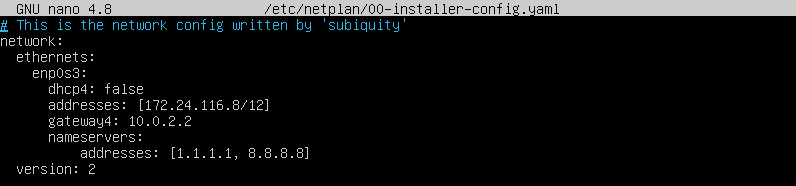
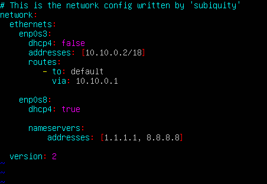
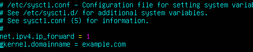
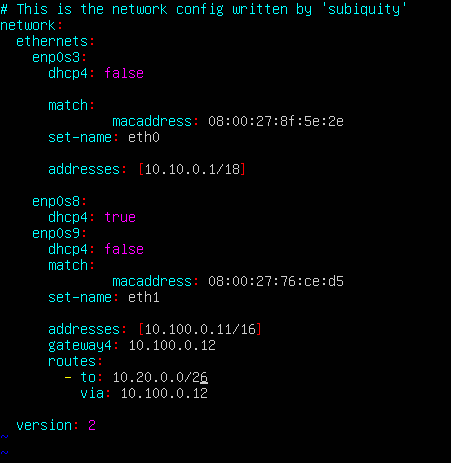
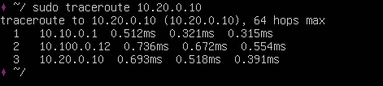

## Part1 ipcalc

#### 1.1 Адрес сети 192.167.38.54/13:

    192.160.0.0 
    
#### 1.2 255.255.255.0 в префиксной форме: /24
    в двоичной:
    11111111.11111111.11111111.00000000
##### /15 в обычной форме: 255.254.0.0
    в двоичной:
    11111111.11111110.00000000.00000000
##### 11111111.11111111.11111111.11110000 в префиксной форме: /28
    в обычной:
    255.255.255.240
    
#### 1.3 Маска /8:
min: 
    12.0.0.1
max: 
    12.255.255.254

##### Маска 11111111.11111111.00000000.00000000:
min: 
    12.167.0.1
max: 
    12.167.255.254

##### Маска 255.255.254.0:
min: 
    12.167.38.1
max: 
    12.167.39.254

##### Маска /4:
min:
    0.0.0.1
max:
    15.255.255.254

#### 2. К приложению работающему на localhost мы можем обращаться с ip адресов формата: 127.x0.x1.x2, где x2 != 0 || 255

#### 3. К частным адресам относятся IP-адреса, значения которых лежат в следующих диапазонах:

    10.0.0.0 – 10.255.255.255

    172.16.0.0 – 172.31.255.255

    192.168.0.0 – 192.168.255.255

10.0.0.45 - private, 134.43.0.2 - public, 192.168.4.2 - private, 172.20.250.4 - private, 172.0.2.1 - public, 192.172.0.1 -public, 172.68.0.2 - public, 172.16.255.255 - private, 10.10.10.10 - private, 192.169.168.1 - public

#### Какие из перечисленных IP адресов шлюза возможны у сети 10.10.0.0/18: 10.0.0.1, 10.10.0.2, 10.10.10.10, 10.10.100.1, 10.10.1.255
- возможны: 10.10.0.2, 10.10.10.10, 10.10.1.255
- невозможны: 10.0.0.1, 10.10.100.1 - интерфейсы администрирования

## Part2. Static routing between two machines

_ip-a вывод_

##### Настройки первой машины:

_ws1_

##### Настройки второй машины:

_ws2_

##### Apply:

_ws1_

_ws2_

#### 2.1 Добавить статический маршрут от одной машины до другой при помощи команды вида ip r add
#### Пропинговать соединение между машинами

_local_

_ping1_

_ping2_

#### 2.2 Добавление статического маршрута с сохранением

_netplan1_

_netplan2_

_ping1_

_ping2_

## Part 3. Утилита iperf3

#### 3.1 Скорость соединения

    8 mbps == 1 MB/s
    100 MB/s == 819200 Kbps
    1 Gbps == 1024 Mbps
    
#### 3.2 iperf3

_speed2_

## Part 4. Firewall

#### 4.1 Iptables

_firewall-1_

_firewall-2_

_firewall-accept_
    

_firewall-accept2_

_ping-1to2_

_ping-2to1_

#### 4.2 nmap

##### Командой **ping** найти машину, которая не "пингуется", после чего утилитой **nmap** показать, что хост машины запущен

_nmap-ws1_

_nmap-ws2_

## Part 5. Static network routing

#### 5.1 Настройка адресов машин

_ws11_

_ws21_

_ws22_

_r1_

_r2_

_ping-ws11-to-r1_

_ping-ws22-from-ws21_

#### 5.2 Включение переадресации ip адресов

_r1_

_r1conf_

_r2_

_r2conf_

#### 5.3 Установка маршрута по умолчанию

##### Подобным образом прописываем маршруты:

_ws11_

##### Вызов ip r:

_ws11_

_ws21_

_ws22_

##### Пропинговать с ws11 роутер r2 и показать на r2, что пинг доходит

_ping_

_tcpdump_

#### 5.4 Добавление статических маршрутов.

_r1_

_r2_

##### Вызвать ip r и показать таблицы с маршрутами на обоих роутерах

_ip-r1_

_ip-r2_

##### Запустить команды на ws11:

_ws11_

IP-адрес 0.0.0.0 - это немаршрутизированный адрес IPv4, который можно использовать в разных целях, обычно как адрес по-умолчанию или адрес-заменитель. 0.0.0.0 - буквально: "эта сеть". В контексте серверов: "Все адреса IPv4 на локальном кмопьютере"

#### 5.5 Построение списка маршрутизаторов

_tcpdumpR1_

_tracerouteWs11_

Вы, наверное, уже знаете, что вся информация в сети передается в виде пакетов. Поток данных разбивается специальным программным обеспечением на небольшие пакеты и передается через сеть интернет на целевой узел, а там собирается обратно.

Каждый пакет проходит на своем пути определенное количество узлов, пока достигнет своей цели. Причем, каждый пакет имеет свое время жизни. Это количество узлов, которые может пройти пакет перед тем, как он будет уничтожен. Этот параметр записывается в заголовке TTL, каждый маршрутизатор, через который будет проходить пакет уменьшает его на единицу. При TTL=0 пакет уничтожается, а отправителю отсылается сообщение Time Exceeded.

Команда traceroute linux использует UDP пакеты. Она отправляет пакет с TTL=1 и смотрит адрес ответившего узла, дальше TTL=2, TTL=3 и так пока не достигнет цели. Каждый раз отправляется по три пакета и для каждого из них измеряется время прохождения. Пакет отправляется на случайный порт, который, скорее всего, не занят. Когда утилита traceroute получает сообщение от целевого узла о том, что порт недоступен трассировка считается завершенной.

#### 5.6 Использование протокола ICMP при маршрутизации

_tcpdump-unknownIp_

_ping-unknown_

## Part 6. DHCP

##### Для r2 настроить в файле /etc/dhcp/dhcpd.conf конфигурацию службы DHCP:

1) указать адрес маршрутизатора по-умолчанию, DNS-сервер и адрес внутренней сети.
2) в файле resolv.conf прописать nameserver 8.8.8.8.

_dhcpd-config-r2_

_dhcpd-resolv_

##### Перезагрузить службу DHCP командой systemctl restart isc-dhcp-server. Машину ws21 перезагрузить при помощи reboot и через ip a показать, что она получила адрес. Также пропинговать ws22 с ws21.

_restart_

_ip-a_

_ping-22from21_

##### Указать MAC адрес у ws11, для этого в etc/netplan/00-installer-config.yaml надо добавить строки: macaddress: 10:10:10:10:10:BA, dhcp4: true

_ws11config_

##### Для r1 настроить аналогично r2, но сделать выдачу адресов с жесткой привязкой к MAC-адресу (ws11). Провести аналогичные тесты

_r1-config_

_resolv_

##### Запросить с ws21 обновление ip адреса

_updatedIp_

_ws21after_

Для того, чтобы запросить обновление у машины ws21 ip адреса, необходимо использовать команды:
-sudo dhclient -r - очищаем текущий ip
-sudo dhclient - назначаем свободный

## Part 7. NAT

Сначала устанавливаем apache2.

##### В файле /etc/apache2/ports.conf на ws22 и r1 изменить строку Listen 80 на Listen 0.0.0.0:80, то есть сделать сервер Apache2 общедоступным

_ws22-conf_

_r1conf_

##### Запустить веб-сервер Apache командой service apache2 start на ws22 и r1

_start-apache-webserver_

##### Добавить в фаервол, созданный по аналогии с фаерволом из Части 4, на r2 следующие правила:

1) Удаление правил в таблице filter - iptables -F

2) Удаление правил в таблице "NAT" - iptables -F -t nat

3) Отбрасывать все маршрутизируемые пакеты - iptables --policy FORWARD DROP

Запускать файл также, как в Части 4

Проверить соединение между ws22 и r1 командой ping

_firewall-r1_

_firewall-open_

_ping_

##### Добавить в файл ещё одно правило:

##### 4) Разрешить маршрутизацию всех пакетов протокола ICMP

##### Запускать файл также, как в Части 4

##### Проверить соединение между ws22 и r1 командой ping

_r1-firewall_

_r1-success-ping_

_ws22-success-ping_

##### Добавить в файл ещё два правила:

##### 5) Включить SNAT, а именно маскирование всех локальных ip из локальной сети 
##### находящейся за r2 (по обозначениям из Части 5 - сеть 10.20.0.0)
##### Совет: стоит подумать о маршрутизации внутренних пакетов, а также внешних 
##### пакетов с установленным соединением

##### 6) Включить DNAT на 8080 порт машины r2 и добавить к веб-серверу Apache, запущенному на ws22, доступ извне сети
##### Совет: стоит учесть, что при попытке подключения возникнет новое tcp-соединение, предназначенное ws22 и 80 порту

_r1-final-config_

_telnet_

## Part 8. SSH Tunnels

##### Запустить на r2 фаервол с правилами из Части 7

##### Запустить веб-сервер Apache на ws22 только на localhost (то есть в файле /etc/apache2/ports.conf изменить строку Listen 80 на Listen localhost:80)

##### Воспользоваться Local TCP forwarding с ws21 до ws22, чтобы получить доступ к веб-серверу на ws22 с ws21

##### Воспользоваться Remote TCP forwarding c ws11 до ws22, чтобы получить доступ к веб-серверу на ws22 с ws11

##### Для проверки, сработало ли подключение в обоих предыдущих пунктах, перейдите во второй терминал (например, клавишами Alt + F2) и выполните команду:
**telnet 127.0.0.1 [локальный порт]**

_ws11-ssh+telnet_

_ws21-ssh_

_ws21-telnet_
